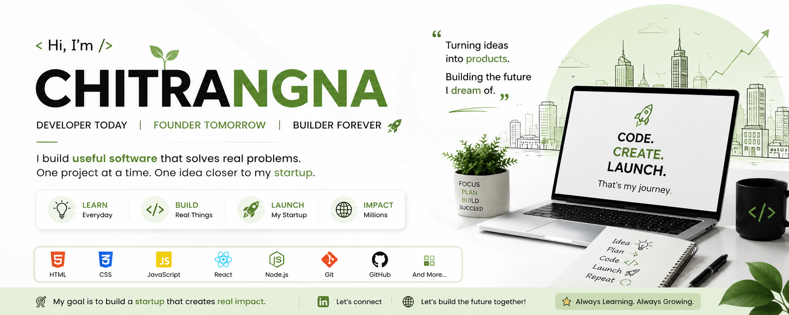
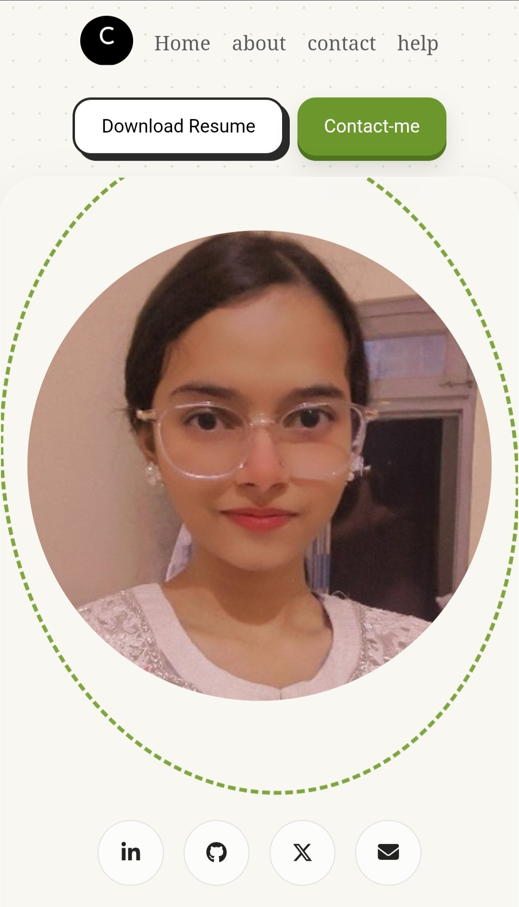

  

# Chitrangna

### Computer Science Undergraduate • Full Stack Developer

Building software that solves real problems — with clean architecture, strong fundamentals, and a habit of shipping.

<a href="#"><!-- replace with your resume link -->

</a>

<a href="#"><!-- replace with your LeetCode profile -->

</a>

 

## 👋 About Me

I'm a Computer Science undergraduate building toward a career in software engineering — currently deepening my understanding of data structures, system design, and full-stack development through consistent, hands-on practice.

I care about writing code that's not just functional but *readable* — and I'm actively working on solving algorithmic problems, contributing to real codebases, and building projects with genuine technical depth rather than surface-level clones.

<!--
Optional: add 1-2 lines here once true — e.g. a specific goal ("targeting SDE roles at product-based companies"),
or a concrete number once you have one ("300+ DSA problems solved"). Specific > generic.
-->

 

## 🧠 Currently Focused On

<table>
<tr>
<td width="50%" valign="top">

**Deepening**
- Data Structures & Algorithms
- System Design fundamentals
- React + Node.js (MERN)

</td>
<td width="50%" valign="top">

**Exploring**
- Express.js & REST API design
- MongoDB data modeling
- Java (OOP + DSA)

</td>
</tr>
</table>

 

## 🛠️ Tech Stack

<table width="80%">
<tr>
<td width="20%"><b>Languages</b></td>
<td></td>
</tr>
<tr>
<td><b>Frontend</b></td>
<td></td>
</tr>
<tr>
<td><b>Backend</b></td>
<td></td>
</tr>
<tr>
<td><b>Database</b></td>
<td></td>
</tr>
<tr>
<td><b>Tools</b></td>
<td></td>
</tr>
</table>

 

## 🚀 Featured Projects

### 🌿 Portfolio Website
Personal developer portfolio — fully responsive, built from scratch with a focus on clean UI and performance.

`HTML` `CSS` `JavaScript`

---

### 🌦️ Weather Application
Real-time weather lookup application consuming a third-party REST API, with error handling for invalid locations and loading states.

`HTML` `CSS` `JavaScript`

<a href="#"><!-- add live demo link once deployed --></a>

---

### 🤖 Telegram Utility Bot
Automation bot built on Node.js using the Telegram Bot API to handle commands and utility tasks.

`Node.js` `Telegram API`

---

### 📋 To-Do Application
Task management app with full CRUD functionality and persistent local state.

`HTML` `CSS` `JavaScript`

<a href="#"><!-- add live demo link once deployed --></a>

<!--
Highest-leverage addition you can make here: one project with real depth —
something involving an algorithm, a system design decision, or a hard technical problem —
described with a specific, honest outcome (not a generic feature list).
-->

 

## 📊 GitHub Analytics

 

## 🤝 Let's Connect

I'm always open to conversations about software engineering, internships, and collaborative projects.

---

<h3>Build • Learn • Improve</h3>

<i>Consistency compounds.</i>

