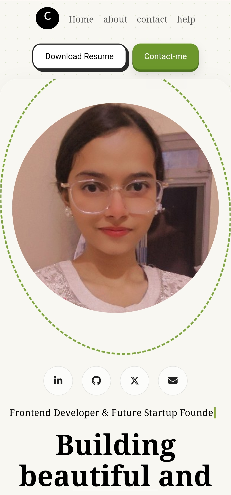

 

# Chitrangna

### Computer Science Student • Full Stack Developer • Building for the Web

I build practical web applications while improving my skills in full-stack development and software engineering.

 

---

## About

I'm a Computer Science student focused on full-stack development and software engineering.

I enjoy building practical web applications, learning modern technologies, and improving through real-world projects.

---

# Current Focus

- Building responsive and accessible web applications
- Deepening my JavaScript fundamentals
- Learning React and Node.js
- Exploring backend development and databases
- Practicing Data Structures & Algorithms
- Improving UI design and user experience

---

# Tech Stack

### Languages

### Frontend

### Backend

### Database

### Tools

---

---# Selected Work

These are some of the projects I've built while learning and exploring modern web development.

---

## 🌿 Portfolio Website

  

**Tech Stack**

`HTML` • `CSS` • `JavaScript`

🔗 **Live:** https://chitrangna.netlify.app/

💻 **Source:** *()*

---

## 🌦 Weather Application

**Tech Stack**

`HTML` • `CSS` • `JavaScript` • `REST API`

💻 **Source:** *()*

---

## 🤖 Telegram Utility Bot

**Tech Stack**

`Node.js` • `Telegram API`

💻 **Source:** *()*

---

## 📝 To-Do Application

**Tech Stack**

`HTML`

`CSS`

`JavaScript`

💻 **Source:** *()*

---

## 🎮 Stone Paper Scissors

**Tech Stack**

`HTML`

`CSS`

`JavaScript`

🔗 **Live:** *()*

💻 **Source:** *()*

---

# GitHub Analytics

### Currently Exploring

- JavaScript (Advanced Concepts)
- React
- Node.js
- Express.js
- MongoDB
- Java
- Data Structures & Algorithms
- Git & GitHub Workflows

---

# 2026 Goals

- Build 20+ high-quality projects
- Master the MERN Stack
- Solve 300+ DSA problems
- Contribute to Open Source
- Improve system design fundamentals
- Build my first SaaS product
- Earn a Software Engineering Internship

---

# Let's Connect

---

# Open to Collaboration

I'm always interested in collaborating on meaningful open-source projects, developer tools, and innovative web applications.

If you're working on something interesting, feel free to connect.

### Thanks for visiting.

Build with purpose.
Learn continuously.
Stay curious.
 

